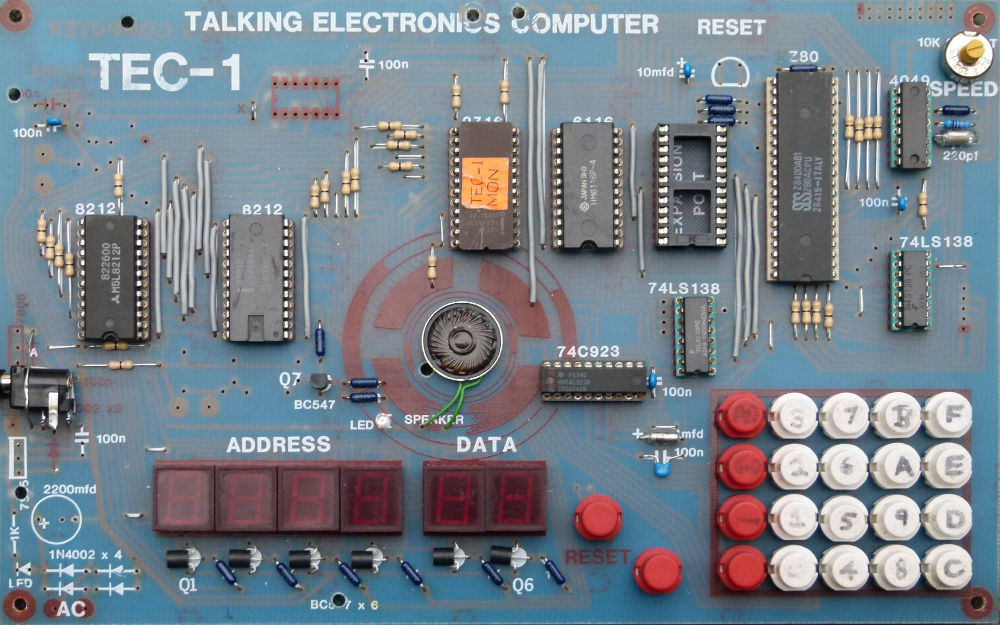

# The TEC-1 Software Repository

A repository for programs written for the TEC-1 and links to other TEC-1 software projects

### Getting started (draft, copied from a Facebook comment)

The best place to start is to read the original magazine articles that accompanied the kit in 1983. Talking Electronics was a magazine which Ken Stone and John Hardy designed the TEC-1 for publication in, the coverage starts in volume 10 and has stuff about the TEC for 6 issues.

https://github.com/tec1group/TE-Magazines

- http://www.talkingelectronics.com/TE-1-15_pdfs/TE-Issue10.pdf
- http://www.talkingelectronics.com/TE-1-15_pdfs/TE-Issue11.pdf
- http://www.talkingelectronics.com/TE-1-15_pdfs/TE-Issue12.pdf
- http://www.talkingelectronics.com/TE-1-15_pdfs/TE-Issue13.pdf
- http://www.talkingelectronics.com/TE-1-15_pdfs/TE-Issue14.pdf
- http://www.talkingelectronics.com/TE-1-15_pdfs/TE-Issue15.pdf

After that you should sharpen your Z80 skills. "Programming the Z80 by Rodney Zaks" is one of the better general references http://www.z80.info/zip/zaks_book.pdf

There are in fact plenty of good books that are available for free online although a physical paper book is still better to read. http://www.z80.info/ is a good place to start.

You will need a ready reference of Z80 instructions.
http://www.z80.info/z80inst.txt (need more on useful Z80 resources)

You need access to an assembler because hand assembly is too much work. Here is an online one which I use a lot
https://www.asm80.com/ (need more on TASM and other popular assemblers and tools). 

You need an actual TEC-1 kit running a monitor program. There are a few versions: Mon 1, Mon 2 (written by Ken Stone) and JMon (written. by Jim Robertson). Mon 1 is the ROM used by the early magazine articles, it has a few games and tunes. Mon 2 fixes some of the issues with Mon 1 and adds some useful functions for inserting code etc. JMon is the most comprehensive and contains additional features for debugging code. (links to binaries for ROMs, or add to this repo)

You can get the source for those here although you should also be able to source a programmed EPROM. https://github.com/TEC-1-Z80-Computer-Group/TEC-1

You can also test drive a working simulation of the TEC-1 online here. This will enable you to try programming the TEC-1 without actually having one. You can also try the different ROMs.
https://github.com/TEC-1-Z80-Computer-Group/wicked-tec1

# TEC-1

Software related to the TEC-1 computer kit designed in 1982 by John Hardy and Ken Stone
and published in Issue 10 of Talking Electronics in early 1983.

# License

Folders in this repository may contain the author's software license, please read that to follow the correct license for that code. Folders which don't have an explicit license file are by default licensed under the [GNU Public License v3](./LICENSE) which allows commercial reuse.

# Updates

* included contributions from bchiha in /magazine_code and /games 
* Updated with Jim Robertson's enhanced and comprehensive JMON monitor ROM
and also the Utilities / Disassembler ROM also written by Jim in collaboration with Mike Donaghy
* Mentioned direct GitHub link for managines
