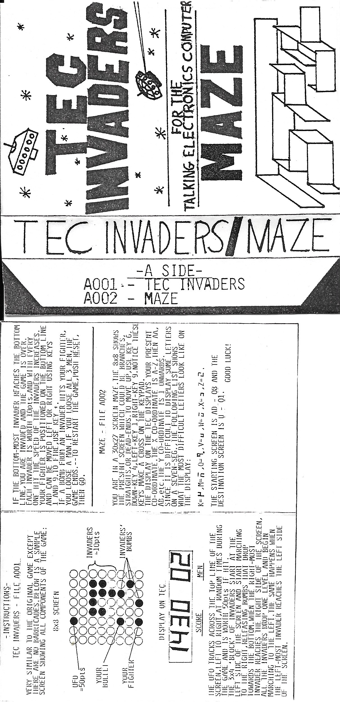

# Cameron Sheppard's TAPE Games

Cameron Sheppard developed two games for the TEC-1.  He worked with Jim Robertson to sell the game on a Tape created using the JMON monitor.

This folder contains the original Binary for the TEC-1, the disassembled copy of it and the original data files *.WAV.  

If loading this game to the TEC-1, it requires the JMON monitor to play as its start location is 0x0900

For the TEC-1G versions, see the TEC-1G software folder.

