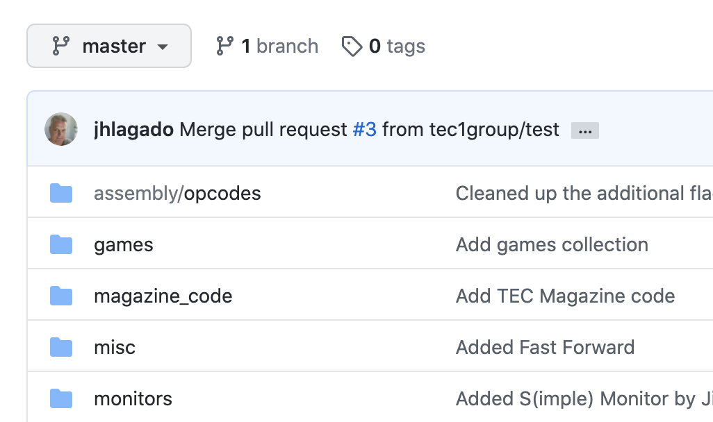
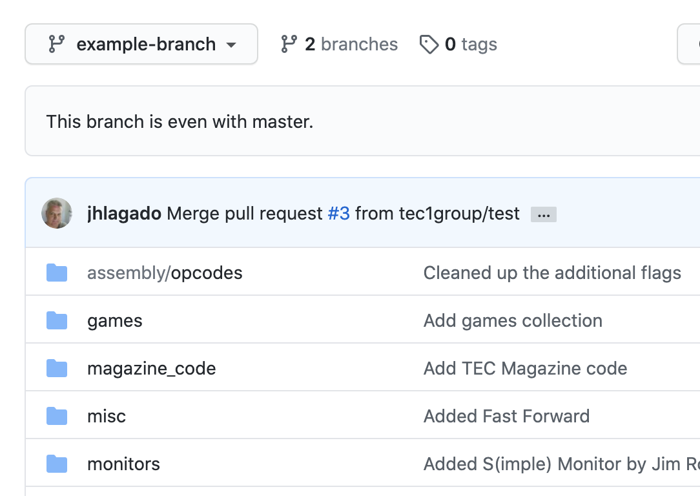
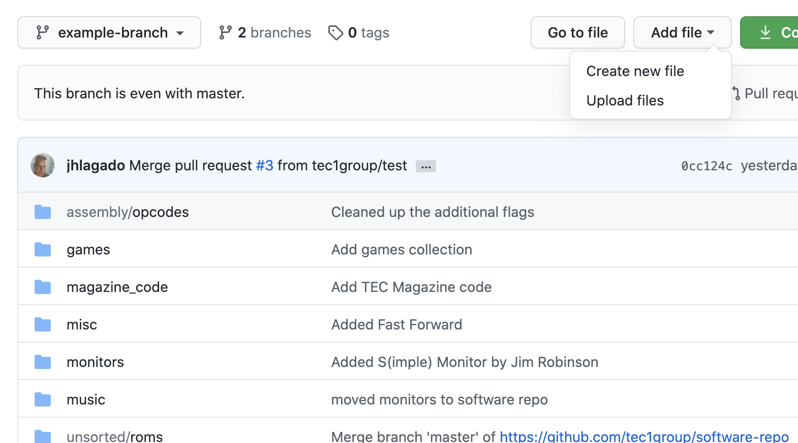
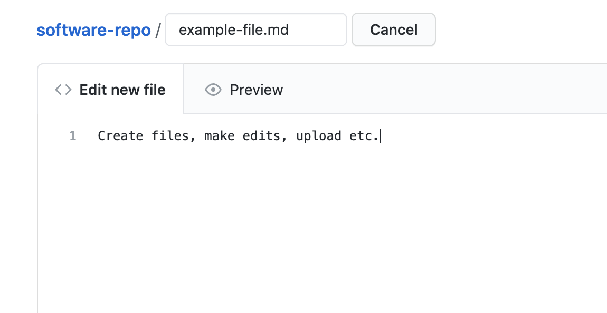
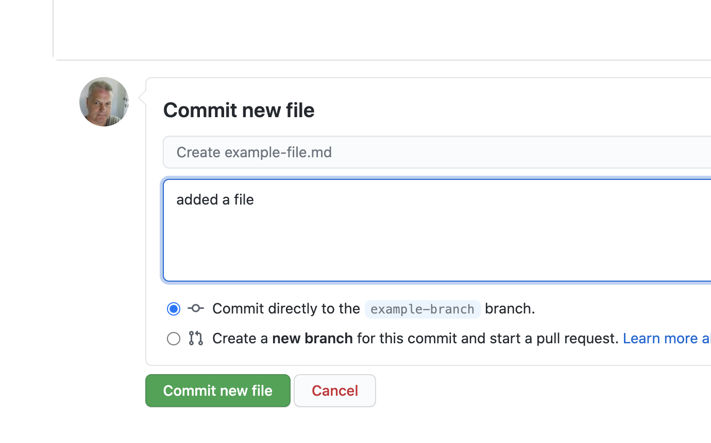
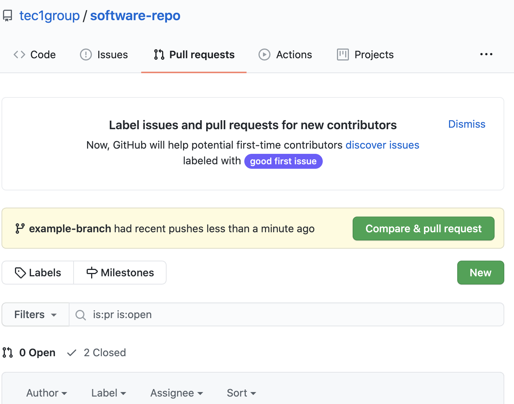
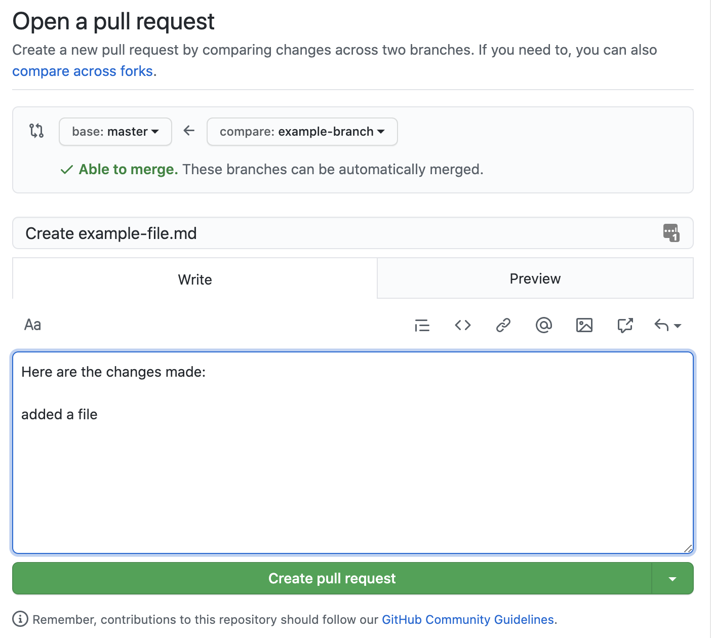
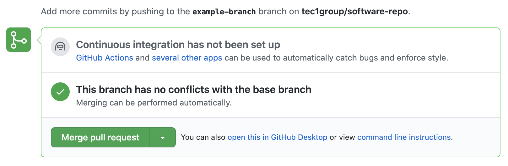
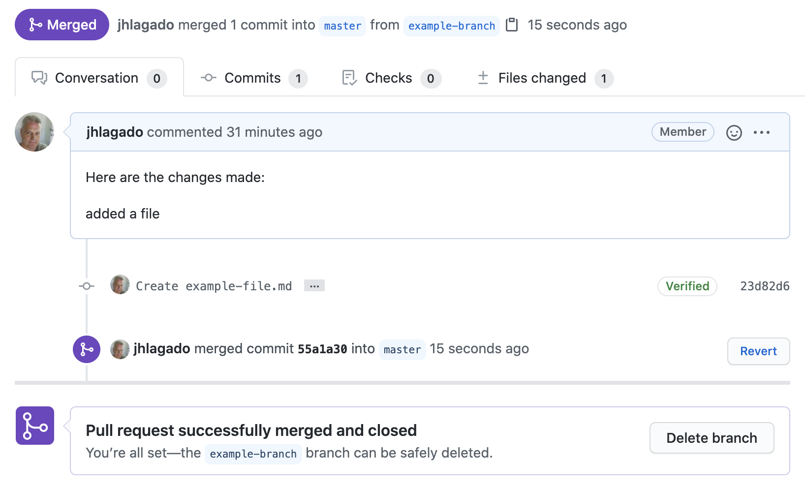

# How to make a pull request using GitHub

## Step 1. Go to the repository

i.e. https://github.com/tec1group/software-repo
Make sure you are signed into GitHub with your account

## Step 2. Create your own branch from master

### 2.1 From the branch selector, select the master branch
   
### 2.1 Type in the name of a new branch where you will be making your changes
   
### 2.3 Select "Create branch" on the drop down
   
### 2.4 You are now in your new branch. Because you branched from master your new branch will have all the same files as master.
   

## Step 3. Make your changes

### 3.1 Create, edit or upload your changes
   
### 3.2 Commit those changes with a short description
   

## Step 4. Create a pull request 
### 4.1 Go to the Pull requests tab. There will be a prompt to create a pull request from your latest changes. Alternatively you can just press "New"

### 4.2 Choose the destination (i.e. base, usually master) and the source (i.e. compare, your branch). Fill out a description of the changes you have made and anything else that might seem reasonable. Press "Create pull request"

### 4.3 Add the people you want to review and approve your pull request 

## Step 5. Your pull request can then be reviewed
### 5.1 Once the pull request has been examined, it can be merged with master. 

### 5.2 Your branch can then be deleted

