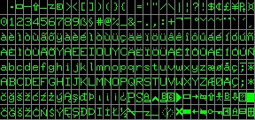
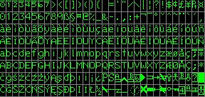

## Unsorted ROMs from Talking Electronics

Recently Alan Laughton contacted me about some undocumented ROM images that he obtained from TE.

```
When I visited Colin Mitchell a few years back, he gave me all the TEC-1 stuff he had.  
That's all been scanned, imaged etc and in the repositories.  
However, there was a tube of 2732 eproms which I have only just imaged.  
No idea whats in them is TEC-1 related, 
would you like to have a look and see if there is anything of interest in them.  
2 appear to be Character Font roms.
```

So far, I've disassembled the ROMs in the simplest way possible. No consideration has been made of the assembly origin, word alignment or data areas vs code. A more careful disassembly and annotation of these ROMs needs to be conducted.

Currently we have no idea where these ROMs came from or what projects they were associated with. The filenames are simply what was found on the labels of the chips and half of them had no label at all. I haven't compared them yet to any of the existing ROMs.

/bin - the original ROM images
/disassembly - a simple disassembly

## Update:

unlabeled-4 and unlabeled-5 are font ROMs for a video display




